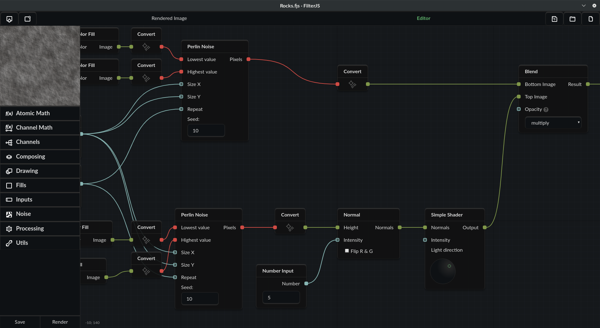

# FilterJS

 
 

 
 

FilterJS is a node-based procedural texture generator. It is easily extensible, and was made to add a free and open-source alternative to similar projects.

You can create textures for any kind of project, e.g. for private or commercial use.

**Disclaimer:** Though there is much room for optimization, FilterJS is a rather slow generator if compared, for example, to Filter Forge or Substance Designer. 

## How to run FilterJS

You will need [node.js](https://nodejs.org/) and [gulp.js](https://gulpjs.com/). Run `npm install --global gulp-cli` to install Gulp.

1. Clone or download the repo;
2. Run `npm install` in its root folder;
3. Run `npm install` in the `./app` folder;
4. Run `gulp` in the root of the repo.

The first run will download the needed binaries of nw.js, but then the gulp command will run FilterJS just in seconds.

## How to hack on FilterJS

1. Do a regular run with `gulp`;
2. Edit files in the `./src/` folder;
3. Changes will appear automagically after saving. Avoid losing unsaved filters!

### Before you commit

- Make your commits as atomic as possible. Commit one serious change at a time. 
- Make sure the `gulp lint` task shows no errors. Warnings are ok until you understand what you are doing, but they can still reveal some common gotchas. Stylint will tell false positives on every `riot-tag`, because it's an old rubbish, but keep an eye on its other warnings.
- Use [gitmoji guide](https://gitmoji.carloscuesta.me/) for naming your commits. Use the imperative mood, like `:sparkles: Add a "Blend" block to Processing`.

## Help wanted!

You can help FilterJS grow by creating new nodes! See the existing ones in the `./src/js/blocks/` folder as an example. There is much to do, including:

* Text, shape, image drawing and scattering;
* `canvas`-based transforms, masking and overlays;
* pixel-based adjustments;
* new noise generators;
* and everything you can come up with.

Some nodes can also be rewritten to WebGL, but I, @CosmoMyzrailGorynych, don't have proper skills for it.

Last but not least, you can help FilterJS just by telling about it to your friends, writing blog posts, etc.
